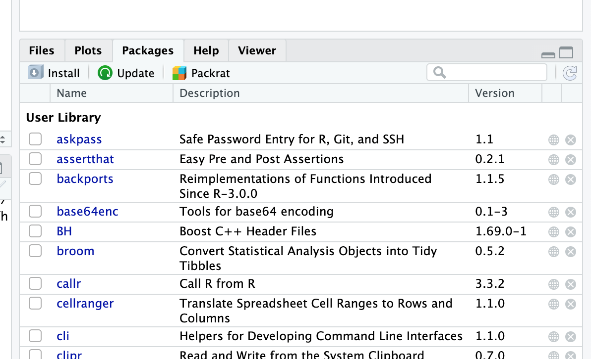
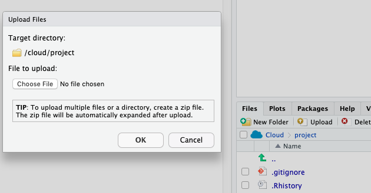

# Getting Started with Data in R {#getting-started}

```{r setup_getting_started, include=FALSE, purl=FALSE}
chap <- 1
lc <- 0
rq <- 0
# **`r paste0("(LC", chap, ".", (lc <- lc + 1), ")")`**
# **`r paste0("(RQ", chap, ".", (rq <- rq + 1), ")")`**

knitr::opts_chunk$set(
  tidy = FALSE, 
  out.width = '\\textwidth', 
  fig.height = 4,
  fig.align = 'center',
  warning = FALSE
)

options(scipen = 99, digits = 3)

# Set random number generator see value for replicable pseudorandomness.
set.seed(76)
```

```{r message=FALSE, warning=FALSE, echo=FALSE}
# Packages needed internally, but not in text.
library(scales)
library(tidyverse)
```

## Learn Objectives 

After this lesson, learners will be able to: 

* Describe the purpose and use of each pane in the RStudio IDE
* Locate buttons and options in the RStudio IDE
* Know how to run code in R
* How to save things to an object in R
* Call functions
* What packages are and where to install and load them
* Inspecting data and doing simple plots
* Make a map in R, exporting images in R 

Source:  The first part of the lesson is largely taken from the ModerDive book <https://moderndive.com/> 
Slides: <https://afam188.netlify.com/day1-slides.html#/>  


## What are R and RStudio? {#r-RStudio}

At its simplest, R is like a car's engine while RStudio is like a car's dashboard as illustrated in Figure.


```{r R-vs-RStudio-1, echo=FALSE, fig.align='center', fig.cap="Analogy of difference between R and RStudio.", out.width='95%', purl=FALSE}
knitr::include_graphics("images/shutterstock/R_vs_RStudio_1.png")
```

More precisely, R is a **programming language** that runs computations, while RStudio is an *integrated development environment (IDE)* that provides an interface by adding many convenient features and tools. So just as the way of having access to a speedometer, rearview mirrors, and a navigation system makes driving much easier, using RStudio's interface makes using R much easier as well. 


### Using R via RStudio

Recall our car analogy from earlier. Much as we don't drive a car by interacting directly with the engine but rather by interacting with elements on the car's dashboard, we won't be using R directly but rather we will use RStudio's interface. 


## How do I code in R? {#code}

Now that you're set up with R and RStudio in RStudio Cloud, you are probably asking yourself "OK. Now how do I use R?". The first thing to note is that unlike other statistical software & mapping programs like Excel, SPSS, or QGIS that provide [point-and-click](https://en.wikipedia.org/wiki/Point_and_click) interfaces, R is an [interpreted language](https://en.wikipedia.org/wiki/Interpreted_language). This means you have to type in commands written in *R code*. In other words, you get to code/program in R. Note that we'll use the terms "coding" and "programming" interchangeably in this book.

While it is not required to be a seasoned coder/computer programmer to use R, there is still a set of basic programming concepts that R users need to understand. Consequently, while this class is not focused on programming, you will still learn just enough of these basic programming concepts needed to explore and analyze data effectively.


### Basic programming concepts and terminology {#programming-concepts}

We now introduce some basic programming concepts and terminology. Instead of asking you to learn all these concepts and terminology right now, we'll guide you so that you'll "learn by doing." Note that in lesson we will always use a different font to distinguish regular text from `computer_code`. The best way to master these topics is, in our opinions, through [deliberate practice](https://jamesclear.com/deliberate-practice-theory) with R and lots of repetition.

* Basics: \index{programming language basics}
    + *Console*: where you enter in commands. \index{console}
    + *Running code*: the act of telling R to perform an act by giving it commands in the console.
    + *Objects*: where values are saved in R. We'll show you how to *assign* values to objects and how to display the contents of objects. \index{objects}
    + *Data types*: integers, doubles/numerics, logicals, and characters. \index{data types} Integers are values like -1, 0, 2, 4092. Doubles or numerics are a larger set of values containing both the integers but also fractions and decimal values like -24.932 and 0.8. Logicals are either `TRUE` or `FALSE` and characters are text such as "cabbage", "The Wire", and "This ramen is delicious." Note that characters are often denoted with the quotation marks around them.
* *Vectors*: a series of values. These are created using the `c()` function, where `c()` stands for "combine" or "concatenate." For example, `c(6, 11, 13, 31, 90, 92)` creates a six element series of positive integer values \index{vectors}.
* *Factors*: *categorical data* are commonly represented in R as factors. \index{factors} Categorical data can also be represented as *strings*. We'll see this difference as we progress through the book.
* *Data frames*: rectangular spreadsheets. They are representations of datasets in R where the rows correspond to *observations* and the columns correspond to *variables* that describe the observations. \index{data frames} We'll cover data frames later in Section.
* *Conditionals*: 
  + Testing for equality in R using `==` (and not `=`, which is typically used for assignment). For example, `2 + 1 == 3` compares `2 + 1` to `3` and is correct R code, while `2 + 1 = 3` will return an error.
  + Boolean algebra: `TRUE/FALSE` statements and mathematical operators such as `<` (less than), `<=` (less than or equal), and `!=` (not equal to). \index{Boolean algebra} For example, `4 + 2 >= 3` will return `TRUE`, but `3 + 5 <= 1` will return `FALSE`.
  + Logical operators: `&` representing "and" as well as `|` representing "or." For example, `(2 + 1 == 3) & (2 + 1 == 4)` returns `FALSE` since both clauses are not `TRUE` (only the first clause is `TRUE`). On the other hand, `(2 + 1 == 3) | (2 + 1 == 4)` returns `TRUE` since at least one of the two clauses is `TRUE`. 
* *Functions*, also called *commands*: Functions perform tasks in R. They take in inputs called *arguments* and return outputs. You can either manually specify a function's arguments or use the function's *default values*. \index{functions} 
  + For example, the function `seq()` in R generates a sequence of numbers. If you just run `seq()` it will return the value 1. That doesn't seem very useful! This is because the default arguments are set as `seq(from = 1, to = 1)`. Thus, if you don't pass in different values for `from` and `to` to change this behavior, R just assumes all you want is the number 1. You can change the argument values by updating the values after the `=` sign. If we try out `seq(from = 2, to = 5)` we get the result `2 3 4 5` that we might expect. 
  + We'll work with functions a lot throughout this book and you'll get lots of practice in understanding their behaviors. To further assist you in understanding when a function is mentioned in the book, we'll also include the `()` after them as we did with `seq()` above.


This list is by no means an exhaustive list of all the programming concepts and terminology needed to become a savvy R user; such a list would be so large it wouldn't be very useful, especially for novices. Rather, we feel this is a minimally viable list of programming concepts and terminology you need to know before getting started. We feel that you can learn the rest as you go.  Remember that your mastery of all of these concepts and terminology will build as you practice more and more.


### Errors, warnings, and messages {#messages}

One thing that intimidates new R and RStudio users is how it reports *errors*, *warnings*, and *messages*. R reports errors, warnings, and messages in a glaring red font, which makes it seem like it is scolding you. However, seeing red text in the console is not always bad.

R will show red text in the console pane in three different situations:

* **Errors**:  When the red text is a legitimate error, it will be prefaced with "Error in…" and will try to explain what went wrong. Generally when there's an error, the code will not run. For example, we'll see in Subsection if you see `Error in ggplot(...) : could not find function "ggplot"`, it means that the `ggplot()` function is not accessible because the package that contains the function (`ggplot2`) was not loaded with `library(ggplot2)`. Thus you cannot use the `ggplot()` function without the `ggplot2` package being loaded first.
* **Warnings**:  When the red text is a warning, it will be prefaced with "Warning:" and R will try to explain why there's a warning. Generally your code will still work, but with some caveats.  
* **Messages**: When the red text doesn't start with either "Error" or "Warning", it's *just a friendly message*. You'll see these messages when you load *R packages* in the upcoming Subsection or when you read data saved in spreadsheet files with the `read_csv()` function. These are helpful diagnostic messages and they don't stop your code from working. Additionally, you'll see these messages when you install packages too using `install.packages()`.

Remember, when you see red text in the console, *don't panic*. It doesn't necessarily mean anything is wrong. Rather:

* If the text starts with "Error", figure out what's causing it. <span style="color:red">Think of errors as a red traffic light: something is wrong!</span>
* If the text starts with "Warning", figure out if it's something to worry about. For instance, if you get a warning about missing values in a scatterplot and you know there are missing values, you're fine. If that's surprising, look at your data and see what's missing. <span style="color:gold">Think of warnings as a yellow traffic light: everything is working fine, but watch out/pay attention.</span>
* Otherwise, the text is just a message. Read it, wave back at R, and thank it for talking to you. <span style="color:green">Think of messages as a green traffic light: everything is working fine and keep on going!</span>


### Tips on learning to code {#tips-code}

Learning to code/program is quite similar to learning a foreign language. It can be daunting and frustrating at first. Such frustrations are common and it is normal to feel discouraged as you learn. However, just as with learning a foreign language, if you put in the effort and are not afraid to make mistakes, anybody can learn and improve. 

Here are a few useful tips to keep in mind as you learn to program:

* **Remember that computers are not actually that smart**: You may think your computer or smartphone is "smart," but really people spent a lot of time and energy designing them to appear "smart." In reality, you have to tell a computer everything it needs to do. Furthermore, the instructions you give your computer can't have any mistakes in them, nor can they be ambiguous in any way.
* **Take the "copy, paste, and tweak" approach**: Especially when you learn your first programming language or you need to understand particularly complicated code, it is often much easier to take existing code that you know works and modify it to suit your ends. This is as opposed to trying to type out the code from scratch. We call this the *"copy, paste, and tweak"* approach. So early on, we suggest not trying to write code from memory, but rather take existing examples we have provided you, then copy, paste, and tweak them to suit your goals. After you start feeling more confident, you can slowly move away from this approach. Think of the "copy, paste, and tweak" approach as training wheels for a child learning to ride a bike. After getting comfortable, they won't need them anymore. 
* **The best way to learn to code is by doing**: Rather than learning to code for its own sake, we find that learning to code goes much smoother when you have a goal in mind or when you are working on a particular project, like analyzing data that you are interested in and that is important to you. 
* **Practice is key**:  Just as the only method to improve your foreign language skills is through lots of practice and speaking, the only method to improving your coding skills is through lots of practice. Don't worry, however, we'll give you plenty of opportunities to do so!

## How to run code/your first script

* Everyone follow this link to our shared workspace:  <https://rstudio.cloud/spaces/31925/join?access_code=PGkF2YGbM3cWUQ76j%2FYUUJWKv3v6c3fa2jQAoxih>
* Inside that project is a folder name:  called `in_class_coding.R`
* Double click on it - this creates your own separate copy of the file. 
* Inside that file you'll see a number of lines with `#` - these are comments.
* Add your name where is says `Your Name` - keep the `#` at the start of the line.

### Let's start coding in R 

* Follow along with me as I live code. I will look at your files to make sure you have participated in live-coding. 
* We can do basic math in R 
* To run the code we can put our cursor on the line we want to run and click on <kbd>Run</kbd> and **Run selected line** in the top right of the script pane.


```{r simple-math}
5 + 3 
```

* We can also use a keyboard shortcut to run the code 
* Use `<cmd>+<enter>` on Mac and `<ctr>+<enter>` on Windows

```{r simple-math-keyboardshortcut}
5 + 10
```

* We can also highlight multiple lines of code and click <kbd>Run</kbd>

```{r highlight-run2}
5 + 10
(5 + 10)/2
```

* The same works with the keyboard shortcut. 
* You can highlight multiple lines and use `<cmd>+<enter>` on Mac and `<ctr>+<enter>` on Windows


```{r highlight-run3}
5 + 10
(5 + 10)/2
```

* These lines of code are sometimes called `expressions` 
* Let's try a few more expressions:

```{r string}
#a string or character sequence is like a name or sentence or alpha numberic in R
"Tim Dennis"
```

* Wait a second what is that line that starts with the `#` symbol? Anyone? 
* It's called a comment and is very useful for you as a coder to leave notes to yourself or others about what's going on in your code
* Anything after the `#` will not be evaluated by R, but remains in the code 

```{r ur-name}
# Use your name instead
"Your Name" #this comment will also be evaulated in the output
```

## Explore your first dataset {#arrests}

In R, the main event is usually working with data! So let's do that. The data we'll use is in our `data/` folder. Let's look at it - its a CSV? What does that stand for?  

Data comes to us in a variety of formats, from pictures to text to numbers.  Throughout this class, we'll focus on datasets that are saved in "spreadsheet"-type format. This is probably the most common way data are collected and saved in many fields. But in R, we can read in data in many formats - this means that R will load the data into it's environment and make it ready for R to work with it.

Before we start exploring our `arrests` data in R, let's first load the packages needed for this lesson. We've touched on packages in the slides, let's revisit. 

## What are Packages 

R packages extend the functionality of R by providing additional functions, data, and documentation. They are written by a worldwide community of R users and can be downloaded for free from the internet. 

A good analogy for R packages is they are like apps you can download onto a mobile phone:

```{r R-vs-R-packages, echo=FALSE, fig.align='center', fig.cap="Analogy of R versus R packages.", out.width='70%', purl=FALSE}
knitr::include_graphics("images/shutterstock/R_vs_R_packages.png")
```

So R is like a new mobile phone: while it has a certain amount of features when you use it for the first time, it doesn't have everything. R packages are like the apps you can download onto your phone from Apple's App Store or Android's Google Play. 

What are the steps to doing this? To install a package, click on the Packages tab on the right bottom pane. Now you can click **Install** and start typing the package you want to install and it will download. 

```{r r-packages-install, out.width='70%', echo=FALSE}

```

How do you find out about packages? Take a look at [task views](https://cran.r-project.org/web/views/) on the CRAN (Comprehensive R Archive Network). Packages are grouped by topic. For this class, because we are using R Studio Cloud, I've already installed the packages we need. 

Once you install a package you need to tell R you want to use it. We do this with the `library()` function. Ok but what is a function? Anybody know? Right functions perform tasks in R. They take inputs called **arguments** (in this case our csv file) and return some kind of output. `library()` takes a package we want to use in our R code and loads it into our current R environment. Let's try now: 

```{r message=FALSE, eval=FALSE}
library(tidyverse)
```

## Reading data into R

`tidyverse` gives us access to a bunch of other functions we can now use after it is loaded.  One is called `read_csv()`. What if we know we need to use `read_csv()` to read in our data, but we don't know how. What would we do? We use R's built in help features to get information on the functions. In R we use a `?` before the function without the trailing parentheses. Type this code in RStudio  and run it:

```{r getting-help-read_csv}
?read_csv
```

We can also call the help menu by using the `help()` function: 

```{r using-help}
help(read_csv)
```

It opens the help documentation in the **Help** tab in the bottom right RStudio pane. It contains a description, usage, arguments and at the bottom, examples, for the function.  We see the first argument of `read_csv()` is a **file** meaning `read_csv()` needs the file location so it can read the file into R. With this information let's read write our `read_csv()` function so it knows where our arrests data is. Remember from earlier, the arrests data is in the `data/` folder in our project. 

Run the the following code: 

```{r, eval=FALSE}
read_csv('data/aug6_12_arrest_data.csv')
```

Ok, notice we need to quote the file location and name. This is because files paths and names are strings in R. Strings are a sequence of characters that can be a sentence, names, filepaths, passowrds, anything that conatains characters or alphanumeric characters. Now when we run it, it outputs the dataset to the console. That's great! We can see our data. Let's get practice running it by running it again. 

```{r read-again-arrests}
read_csv('data/aug6_12_arrest_data.csv')
```

Look at the output in the console. It gives us some important information about our data frame. 

```{block, type='challenge'}
## Inspect the Console Data Output
What does the output tell us? How many rows are in our data? Columns? What about this part?

>cols(
>  latitude = col_double(),   
>  longitude = col_double(),   
>  zipcode = col_double(),  
>  age = col_double(),   
>  sex = col_character(),   
>  race_cat = col_character(),   
>  arrest_type = col_character(),   
>  arr_date2 = col_date(format = "")    
>)

 What is this telling us about our data? 
```

Yes, the last part tells us the type of data R thinks our data is. `age` is a number of double type, `sex` is a character type, `arr_date2` is a date.


### Reading and Saving Data in R

This has been helpful, but the problem is we want to do more with our data than outputting it to the console. In order to save our data and work on it, we need to make it into an **object** in R. Let's do this now by typing the following and running it:

```{r}
arrests <- read_csv('data/aug6_12_arrest_data.csv')
```

Let's look at this. The `<-` symbol is called an assignment operator and you can read it like this. We are assigning what's on the right of 
`<-` to the object on the left. After we run it, `arrests` will hold our dataset and it becomes an object in R. In R we call this type of object a data frame. You can think of it as what R calls a spreadsheet that is set up to be used in R.


```{block, type='callout'}
## Getting data into RStudio Cloud

The data we are using in this class has been provided for us, but what if you want to get data into RStudio Cloud? 

We can use the upload button in the **Files** tab:



```


## What to do first after you read in your data? 

After we run this, notice the top left **Environment** tab in RStudio. We now see  `arrests` listed under **Data**. We can click on that to open and look at it in an `arrests` tab in our main editing window. Take a moment and explore the data via this window? Notice you can filter the data, sort and view the data, but not edit it. 

The below functions take as their "argument" (their input) the data frame. 

1. Using the `View()` function, which brings up RStudio's built-in spreadsheet viewer.
  * This is the same as clicking on the data frame in the **Environment** tab
1. Using the `glimpse()` function, which is included in the `dplyr` package.
1. Using the `str()` function - gives you similar info as `glimpse()`
1. The functions `head()` and `tail()` also let you inspect the data frame. 
1. `$` is a symbol that let's us look at one column of a data frame, like so: 

Let's use `glimpse` to look at our data and attributes. 

```{r using-glimps, eval=FALSE}
glimpse(arrests)
```

We can look at a single column using the `$` like so:

```{r dollar-sign, eval=FALSE}
arrests$race_cat
```

### Ways to get an overview of your data

Often we want to see counts or summary statistics of our data. One easy way is to use the package `DataExplorer` to create a report on our data frame. Let's see how it works:

```{r data-explorer, eval=FALSE}
#remember we need to tell r we want to use DataExplorer
library(DataExplorer)
#DataExplorer has a function called create_report()
create_report(arrests)
```

This gives us a webpage with a bunch of information on our report. Consider this a 10,000 foot view of the data.

Another thing I like to do is see a contingency table of a specific variable: 

```{r table-var}
table(arrests$race_cat)
```

This gives you the tallies by that column in your data frame. 

Lastly we can view the summary statistics with the `summary()` function:

```{r summary-stats}
summary(arrests)
```
This provides you with the `min`, `median`, `mean` quartiles, and `max` all at once.

## Looking at specific variables 

We will often want to look at graphs of specific variables and how they relate to other variables.  We can use a plotting package for this? The most popular one in R is called `ggplot2` and let's us make publication quality graphics of our data. GGPLOT is part of the `tidyverse` so we do not need to install it or load it. Let's start by looking at a bar chart with `race_cat`. 

```{r bar-chart-race}
ggplot(arrests, aes(x = race_cat)) +
  geom_bar()
```

It creates a bar chart of our `race_cat` and the count of arrests for this period of data we have. But what if we want to add another variable to the bar chart making it a staked bar? We can do this through the `fill` argument. What's an argument again? 

```{r}
ggplot(arrests, aes(x = race_cat, fill=arrest_type)) +
  geom_bar()
```

One thing about stacked bar charts is that it is often hard to tell by sight the proportions represented. Often, it's recommended to use bar charts that are side by side. We can do this via the `position` argument inside the `geom_bar` function. 


```{r}
ggplot(arrests, aes(x = race_cat, fill=arrest_type)) +
  geom_bar(position = "dodge")
```

```{block, type='challenge'}
## Replace the fill with `sex` and run

Replace the fill with `sex` and run the code. 
```

Ok, good. Let's look at some other plots we can use. 

```{r barchart}
ggplot(arrests, aes(x = race_cat, fill=sex)) +
  geom_bar(position = "dodge")
```

### Variable distribution 

One thing we often want to look at is the distribution of a single variable. This is often visualized via a histogram. Let's look at a histogram of `arrest_time`. 

```{r histogram}
ggplot(arrests, aes(x=arrest_time)) + geom_histogram()
```

Not surprisingly, we see more arrests seems to build up during the day.  One thing to know about a histogram is that you can adjust how the `geom_histogram()` bins the counts using either `binwidth` or `bins` argument. I'll use `bindwidth` below. Notice b/c time is so granular, so many values, you need to pick a big number. 

```{r histogram-binwidth}
ggplot(arrests, aes(x=arrest_time)) + geom_histogram(binwidth = 500)
```


### Two variables 

You often want to see the distribution of a variable based on another. Let's use a `boxplot` to generate `arrest_type` by `age` with a boxplot.

```{r}
ggplot(arrests, aes(x=arrest_type, y=age)) + geom_boxplot()
```

```{block, type='challenge'}
## Change the x value to another category (sex, race_cat, etc.)
[todo]:#make a challenge here to fill in for boxplot
```

```{r}
ggplot(arrests, aes(x=race_cat, y=age)) + geom_boxplot()
```

[todo]:#make a challenge here to try violin plot
