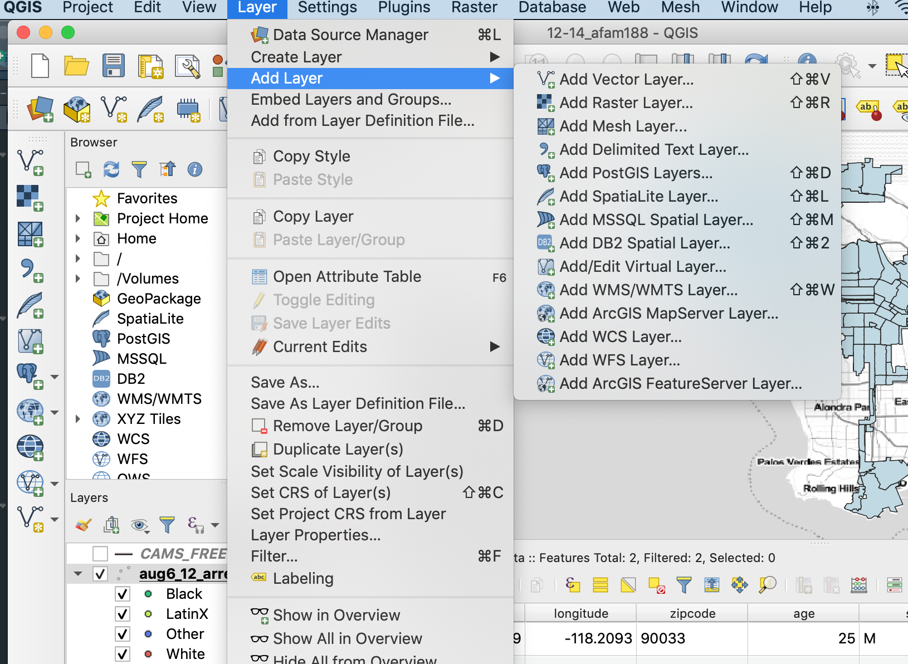
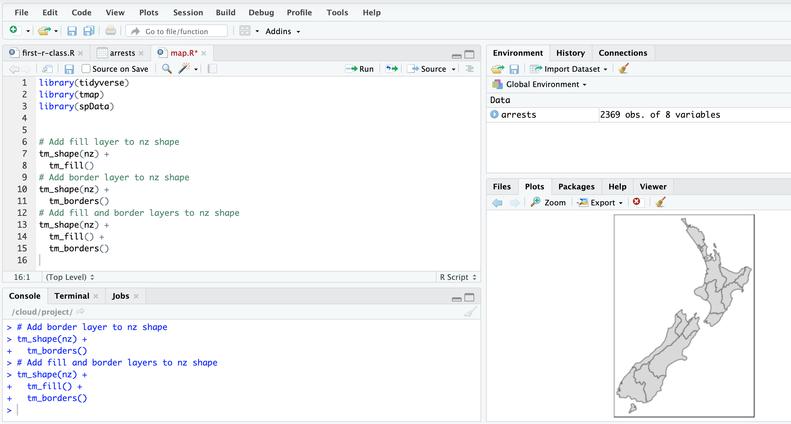

Getting Started with R
========================================================
author: Tim Dennis
date: 2019-11-04
autosize: true

Today's Learning Objectives
========================================================
* Understand and use of each pane in the RStudio IDE
* Locate buttons and options in the RStudio IDE
* Run code
* Save things to an object
* Call functions
* Know what packages are and how to install and load them
* Inspecting data and doing simple plots
* Make a map in R, exporting images in R

What are R and RStudio?
========================================================

At its simplest, R is like a car's engine while RStudio is like a car's dashboard

R & RStudio
========================================================

* R is a **programming language** that runs computations
* RStudio is an *integrated development environment (IDE)* that provides an interface by adding many convenient features and tools
* RStudio Cloud provides us access to RStudio & R in the cloud via a web browser

Using R via RStudio
========================================================

Much as we don't drive a car by interacting directly with the engine but rather by interacting with elements on the car's dashboard, we won't be using R directly but rather we will use RStudio's interface.

How do I code in R?
========================================================
* Unlike other statistical software & mapping programs like Excel, SPSS, or QGIS that provide [point-and-click](https://en.wikipedia.org/wiki/Point_and_click) interfaces, R is an [interpreted language](https://en.wikipedia.org/wiki/Interpreted_language)
* This means you have to type in commands written in *R code*.

Menu verses Code
=======================================================

***

Programming concepts and terminology
=====================================================

* There's a lot of terminology in programming and R - we don't expect you to learn all of it now
* We'll take a **learn by doing** approach in this class
* We've created a [glossary](https://moodle2.sscnet.ucla.edu/mod/glossary/view.php?id=504552&mode=letter&hook=ALL) in the course on some basic ones you can reference if you get stuck.
* The [primers](https://rstudio.cloud/learn/primers) in RStudio Cloud also give you some context to concepts and terms.

Learning to Code
========================================================

>The best way to master these topics is, in our **opinions**, through [deliberate practice](https://jamesclear.com/deliberate-practice-theory) with R and lots of repetition.

Tips on learning to code
=========================================================

* **Remember that computers are not actually that smart**
* **Take the "copy, paste, and tweak" approach**
* **The best way to learn to code is by doing**
* **Practice is key**

How the class works
========================================================

* I'll be live coding in RStudio Cloud
* You'll be following along with me, typing all the code and running it
* You have your own copy of the class notes R script  and I'll check to make sure you participating
* We also have a separate R Script called challenges that I'll prompt you to solve inclass
* The important things is to try, we'll go over answers together

Let's start
========================================================

Follow this link to the shared RStudio Project.
It is also in your course website.

