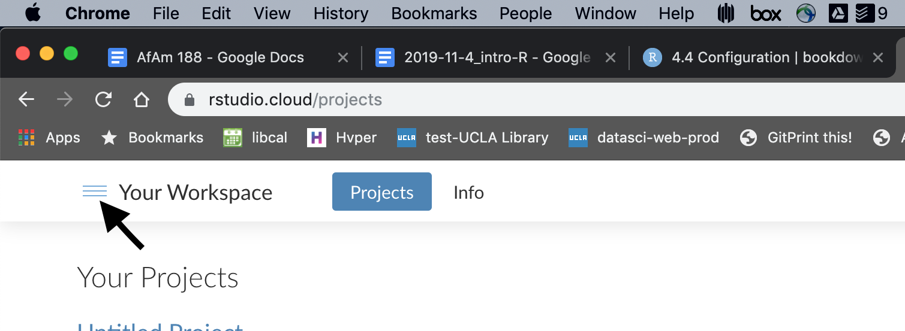
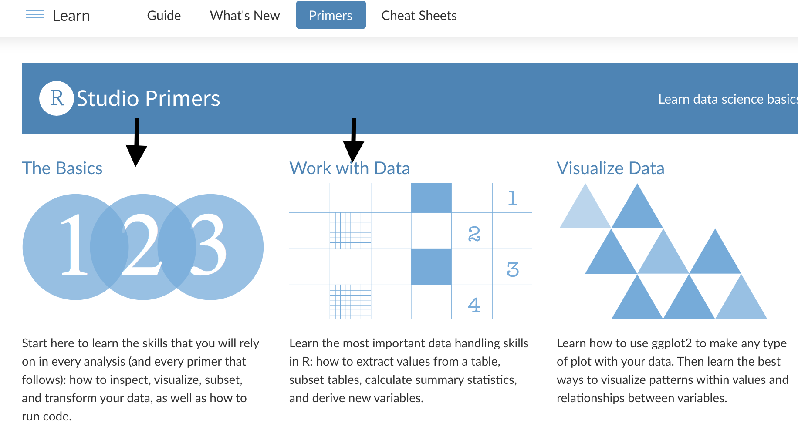

--- 
title: "African American Studies 188: Intro to R & Mapping in R"
author: "Tim Dennis"
date: "`r Sys.Date()`"
site: bookdown::bookdown_site
output: bookdown::gitbook
documentclass: book
bibliography: [book.bib, packages.bib]
biblio-style: apalike
link-citations: yes
github-repo: rstudio/bookdown-demo
description: "This is ."
---

# Prerequisites

Before the first class on Oct. 4 get a RStudio Cloud account and take thee R primers on RStudio Cloud. 

1. Go to <https://rstudio.cloud> and create an account. Use your email account associated with the campus google account (the one with the  `@g.ucla.edu` as it's base). 

2. Once logged in, you can navigate to the primers, by clicking the menu toggle icon:

```{r rstudio-cloud, out.width = "90%",echo=FALSE}

```

Then select the Primers menu item: 

```{r locate-primers, out.width = "90%",echo=FALSE}
knitr::include_graphics("images/primers.png")
```


Take the primer "The Basics", which has two tutorials named "Visualization Basics" and "Programming Basics". These will take you about between an 1.5 or 2.0 hours.  

```{r primers-todo, out.width="400pt", echo=FALSE}

```
